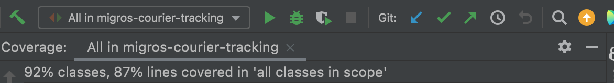

# Migros-Courier-Tracking

A Restful web application that trracks the streaming geolocations of couriers and provides the total distance travelled by each courier.


## TechStack
 - Java17
 - Spring Boot
 - MySQL
 - Docker

## How To Run With Docker
- Clone the repository
```bash
$ git clone git@github.com:ataberkcanitez/Migros-Courier-Tracking.git
```
- Navigate to the project directory:
 ```bash
$ cd Migros-Courier-Tracking
 ```
then
```bash
$ make up
 ```
or
```bash
$ docker-compose up
 ```
wait until it buids and runs the application. Please check if there is any other process that uses `8081` port.


## Testing
- To execute unit tests
```bash
$ mvn clean test
```

Code coverage Report:
`Classes: 92%` `Lines: 87%`




## Api's and Usage
### Store
- `/api/v1/stores/{storeId}` `GET`: returns the store detail with given id
- `/api/v1/stores/{storeId}` `DELETE`: deletes the store with given id
- `/api/v1/stores` `POST`: creates a new store,Request Body:
```json
{
    "name": "test",
    "location": {
        "lat": 1.1,
        "lon": 2.2
    }
}
```

### Courier
#### Restful Api's
- `/api/v1/courier/{courierId}/total-travel-distance` `GET`: returns the total travel distance of courier with given id

For easy use check postman collections in the `docs/postman-collection` directory

#### Streaming Api's
- `/ws/courier-location` `WebSocket`, Request Body: Receives the courier location, updates the `total-travel-distance` and finds nearby stores with 100 meter that didn't entered within 1 minutes and saves as a `entrance`
```json
{
    "courierId": 1,
    "location": {
        "lat": 40.9923307, 
        "lon": 29.1244229
    }
}
```
- You can use `Postman` to test `WebSocket` api. (can't share the websocket collection, you have to build it for yourself)
- First click `new` then select `WebSocket Request` and enter the url `ws://localhost:8081/ws/courier-location`
- Then click `Connect` button
- Then click `Send` button to send the request body above

### Notes
- Docker container is running on port `8081` to prevent any conflict with other applications.
- After you start the container, you can use `http://localhost:8081` as base url
- You can see the `logs` and check the `database` if you want with `docker`
- In the migration file I already added `10` couriers, please use courier id between `1-10` otherwise there will be errors because of foreign keys.


### Future Optimizations
- Authentication
- Crud operations for courier
- R-tree or quadtree index for finding nearby stores


